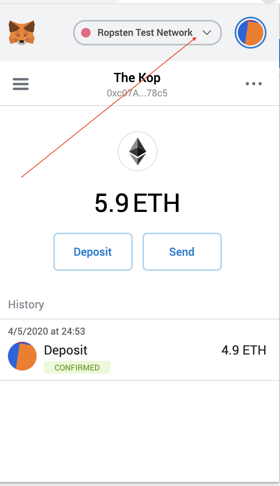
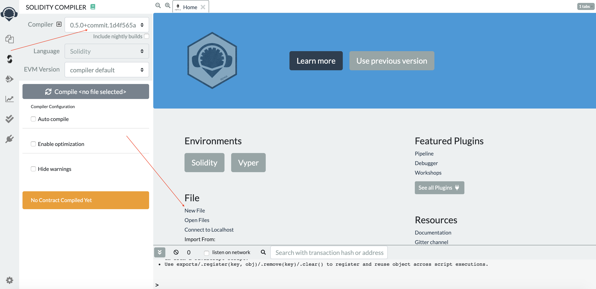
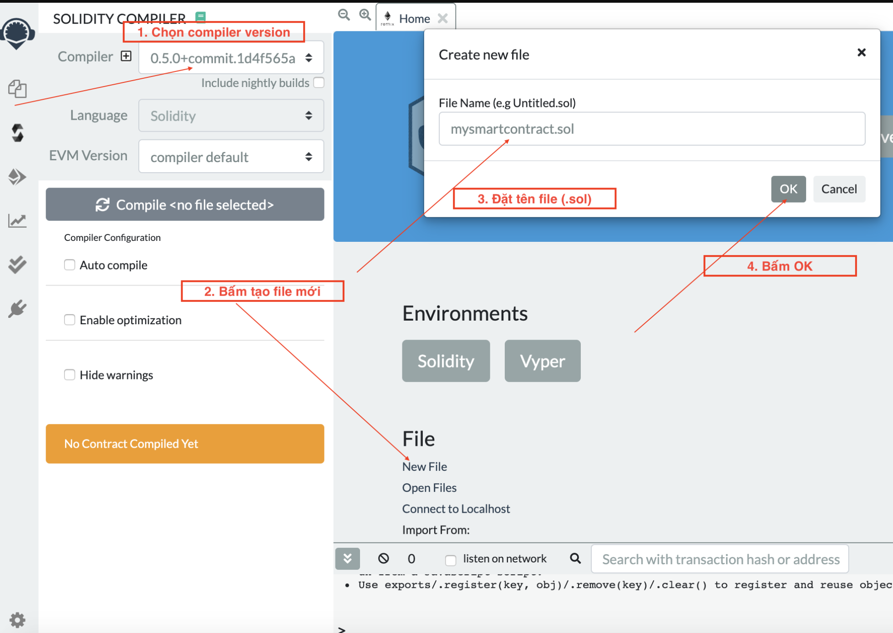
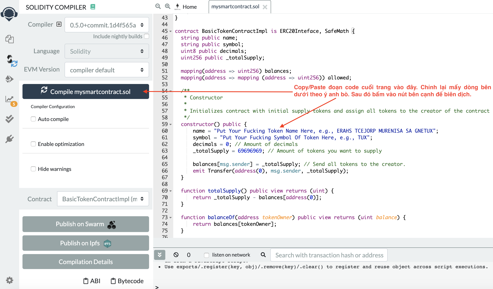
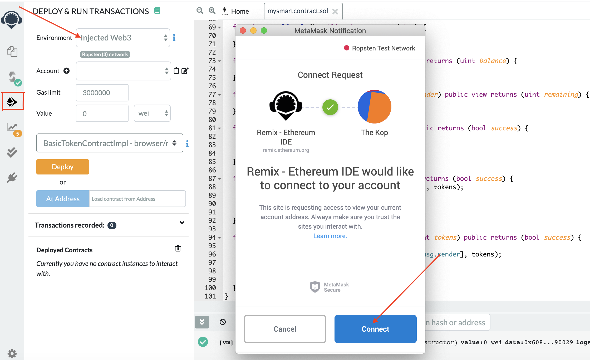
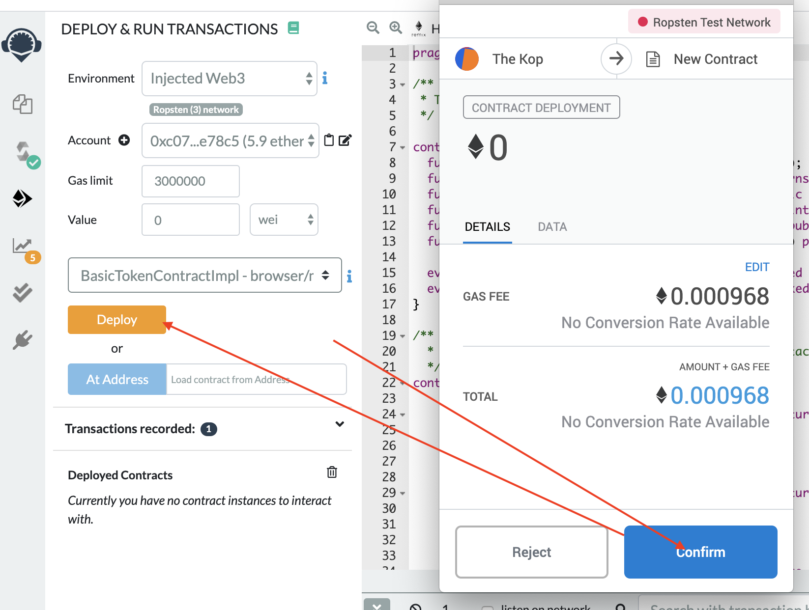
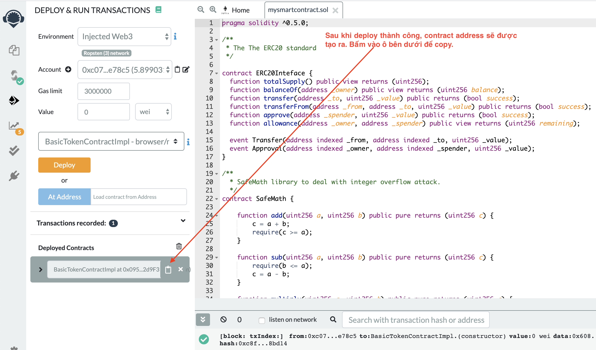
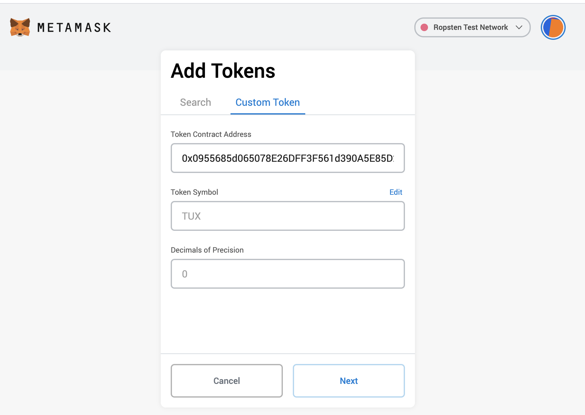
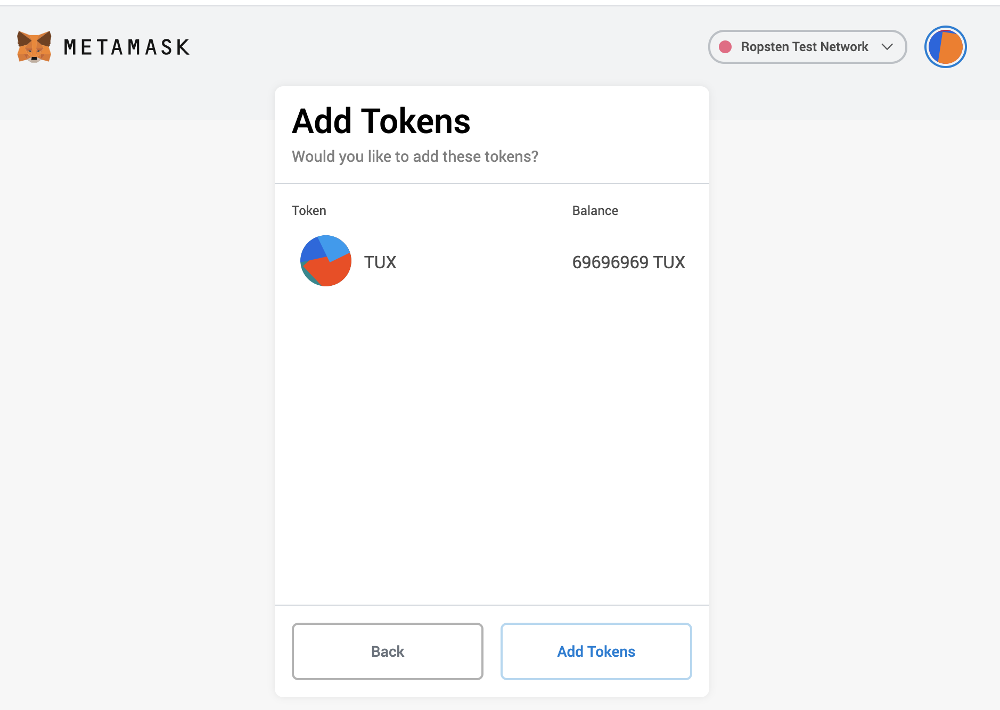
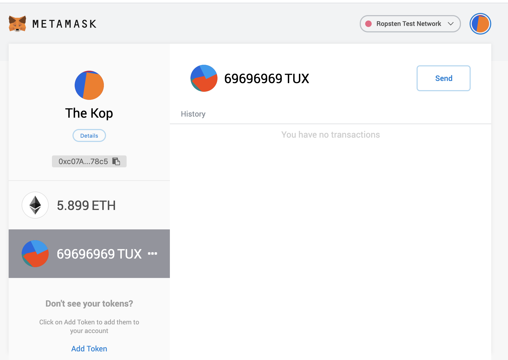

# Hướng dẫn tạo hợp đồng khôn chuẩn ERC

# Mục đích
Hướng dẫn anh bò tay ngang tạo một loại token cho riêng mình trong một phát dắm. Nếu đéo quá đần độn, anh bò sẽ:
- [x] Nắm được cách tạo một hợp đùng khôn (aka smart contract) theo đúng chuẩn ERC-20.
- [x] Sử dụng ví **Metamask** trong môi trường **Ropsten Test Network** để xin ETH đểu và tiêu pha chúng.
- [x] Đam mê xèng mạng thêm tí chút.

# Chuẩn bị đồ nghề

1. Công cụ soạn thảo: Anh bò có thể dùng bất cứ công cụ soạn thảo văn bản đơn giản nào mà anh thích. Tỉ dư: **Notepad, Notepad++, Sublime Text, Atom, etc,...**

2. Cài **Metamask**  extension trên browser của anh bò.

# Coding and deployment

Để deploy một hợp đùng khôn, anh bò sẽ bị xẻo mất một tẹo ETH trong ví metamask của mình. Anh bò nên chạy thử trên mạng **Ropsten Test Network** trước khi kịp hới mưng đưa token của anh vào **Main Etherum Network**. 

Anh bò bật Metamask lên và chuyển sang mạng **Ropsten Test Network**.



Đang ở trong **Ropsten Test Network** nên anh có thể vào [chỗ này](https://faucet.ropsten.be/) hoặc [chỗ này](https://faucet.metamask.io/) để xin ETH đểu phục vụ mục đích testing. Anh bò nhập địa chỉ ví của anh vào và bấm nút. Chờ xíu, xèng sẽ về ví.

Cuối trang là toàn bộ code đã đúc sẵn cách đơn giản nhất, anh bò có thể copy và mang lên [Remix](https://remix.ethereum.org/#optimize=false&evmVersion=null&version=soljson-v0.5.0+commit.1d4f565a.js) để chạy.

Một số hình ảnh nhạy cảm trích xuất trong qúa trình hành sự mà anh bò sẽ trải qua dùng **Remix**.

Chọn trình biên dịch và tạo file





Bấm vào biểu tượng *Deploy and Run* ở thanh menu dọc bên trái và chọn Environment **Injected Web3**, hệ thống sẽ tự động bật **Metamask** lên và yêu cầu anh bò cồng phơm

<br/>
<br/>

Copy địa chỉ hợp đồng khôn

<br/>

Paste cáy địa chỉ mà anh bò vừa copy vào ví **Metamask**. Nghe mấy hình sau nhẽ anh bò không tránh khỏi cảm xúc thân quen? :))

<br/>
<br/>
<br/>

# Sample Code
Copy đoạn code bên dưới và paste vào Remix file editor, chỉnh sửa lại giá trị của một số biến đã gợi ý trong hàm **constructor**

```solidity
pragma solidity ^0.5.0;

/**
 * The ERC20 standard
 */

contract ERC20Inteface {
  function totalSupply() public view returns (uint256);
  function balanceOf(address _owner) public view returns (uint256 balance);
  function transfer(address _to, uint256 _value) public returns (bool success);
  function transferFrom(address _from, address _to, uint256 _value) public returns (bool success);
  function approve(address _spender, uint256 _value) public returns (bool success);
  function allowance(address _owner, address _spender) public view returns (uint256 remaining);

  event Transfer(address indexed _from, address indexed _to, uint256 _value);
  event Approval(address indexed _owner, address indexed _spender, uint256 _value);
}

/**
  * SafeMath library to deal with integer overflow attack. 
  */
contract SafeMath { 

    function add(uint256 a, uint256 b) public pure returns (uint256 c) {
        c = a + b;
        require(c >= a);
    }

    function sub(uint256 a, uint256 b) public pure returns (uint256 c) {
        require(b <= a);
        c = a - b;
    }

    function multiply(uint256 a, uint256 b) public pure returns (uint256 c) {
      c = a * b;
      require(a == 0 || c / a == b);
  }

    function divide(uint256 a, uint256 b) public pure returns (uint256 c) {
      require(b > 0);
        c = a / b;
    }
}

contract BasicTokenContractImpl is ERC20Inteface, SafeMath {
  string public name;
  string public symbol;
  uint8 public decimals;
  uint256 public _totalSupply;

  mapping(address => uint256) balances;
  mapping(address => mapping (address => uint256)) allowed;
    
  /**
   * Constructor
   *
   * Initializes contract with initial supply tokens and assign all tokens to the creator of the contract
   */
  constructor() public {
      name = "Put Your Fucking Token Name Here, e.g., ERAHS TCEJORP MURENISA SA GNETUX";
      symbol = "Put Your Fucking Symbol Of Token Here, e.g., TUX";
      decimals = 0; // Amount of decimals
      _totalSupply = 69696969; // Amount of tokens you want to supply
      
      balances[msg.sender] = _totalSupply; // Send all tokens to the creator.
      emit Transfer(address(0), msg.sender, _totalSupply);
  }

  function totalSupply() public view returns (uint) {
      return _totalSupply - balances[address(0)];
  }

  function balanceOf(address tokenOwner) public view returns (uint balance) {
      return balances[tokenOwner];
  }

  function allowance(address tokenOwner, address spender) public view returns (uint remaining) {
      return allowed[tokenOwner][spender];
  }

  function approve(address spender, uint tokens) public returns (bool success) {
      allowed[msg.sender][spender] = tokens;
      emit Approval(msg.sender, spender, tokens);
      return true;
  }

  function transfer(address to, uint tokens) public returns (bool success) {
      balances[msg.sender] = sub(balances[msg.sender], tokens);
      balances[to] = add(balances[to], tokens);
      emit Transfer(msg.sender, to, tokens);
      return true;
  }

  function transferFrom(address from, address to, uint tokens) public returns (bool success) {
      balances[from] = sub(balances[from], tokens);
      allowed[from][msg.sender] = sub(allowed[from][msg.sender], tokens);
      balances[to] = add(balances[to], tokens);
      emit Transfer(from, to, tokens);
      return true;
  }
}
```

# Reference Resources:
1. [https://www.toptal.com/ethereum/create-erc20-token-tutorial](https://www.toptal.com/ethereum/create-erc20-token-tutorial)
2. [https://blockchaininformer.com/blockchain/tutorial-create-erc-20-token](https://blockchaininformer.com/blockchain/tutorial-create-erc-20-token)
